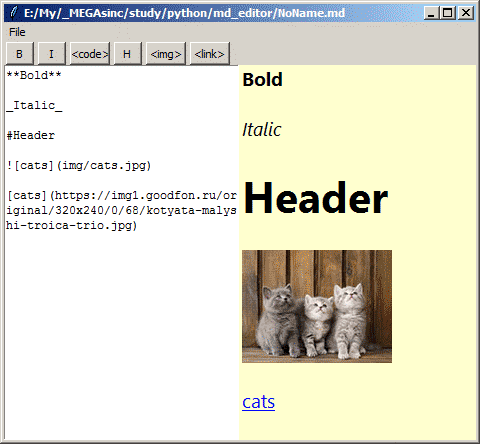

# md_editor

редактор *.md файлов, для правки README, честно списанный с [How to Build a Toy Markdown Editor](https://www.freecodecamp.org/news/lets-create-a-toy-markdown-editor-with-python-tkinter/)
Добавлены кнопки для форматирования. Возможно буду вносить дополнения, или нет.
